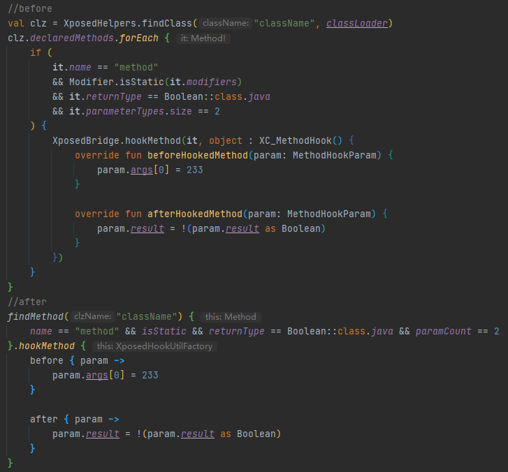

# EzXHelper
    
Một thư viện Kotlin giúp phát triển module Xposed trở nên dễ dàng hơn    
Phiên bản mới nhất hiện tại: 1.0.3

### Lưu ý

**Cảnh báo về số lượng lớn các hàm/thuộc tính mở rộng/Top-Level**

**Thư viện này vẫn đang trong quá trình phát triển, bạn có thể gặp phải các vấn đề bao gồm nhưng không giới hạn ở những điều sau:**

- Xuất hiện lỗi
- Thay đổi tên hàm, tham số

**Những thay đổi lớn:**

- Phiên bản 0.5.0 đã thay đổi tên một số hàm, ví dụ `findXxxByCondition` đã được đổi thành `findXxx`, và các tham số cũng đã được sửa đổi, vui lòng lưu ý khi cập nhật lên phiên bản này.
- Phiên bản 0.7.1 đã thay đổi kiểu tham số gọi phương thức và constructor, vui lòng thay thế hàm `arrayOf()` cũ bằng `args()` và `argTypes()`.
- Phiên bản 0.7.5 đã nâng `minSdkVersion` từ 21 lên **24**.
- Phiên bản 0.9.2 một lần nữa sửa đổi tên một số hàm, ví dụ `getXxxByClassOrObject` đã được đổi thành `xxx`, trở nên ngắn gọn hơn, đồng thời `ReflectUtils.kt` đã được chia thành nhiều phần và loại bỏ một số thuộc tính/hàm mở rộng không cần thiết.

## Cách sử dụng

Thêm câu lệnh `implementation 'com.github.kyuubiran:EzXHelper:1.0.3'` vào dependencies trong build.gradle   
Gọi `EzXHelperInit.initHandleLoadPackage(lpparam)` để khởi tạo, sau đó bạn có thể sử dụng hầu hết các lớp tiện ích

### Ví dụ

### Tính năng

- Tìm kiếm phương thức (thông qua điều kiện, Descriptor, v.v.)
- Tìm kiếm thuộc tính (thông qua điều kiện, Descriptor, v.v.)
- Các thuộc tính mở rộng khác nhau (ví dụ: Member có thể trực tiếp xác định xem nó có phải là public, private, static, v.v.)
- Các hàm mở rộng khác nhau (ví dụ: có thể sử dụng Class.newInstance để gọi constructor có tham số để khởi tạo đối tượng, obj.invokeMethod để gọi phương thức thành viên, obj.getObject để lấy đối tượng, v.v.)
- Tiêm tài nguyên (khi sử dụng context của ứng dụng chủ, vẫn có thể sử dụng tài nguyên của module)
- Khởi chạy Activity của module (chưa đăng ký) trong ứng dụng chủ với tư cách là ứng dụng chủ

### Các dự án sử dụng thư viện này

|                                   Tên dự án                                    | Giới thiệu dự án                                                                                      |
|:-------------------------------------------------------------------------:|:--------------------------------------------------------------------------------------------------|
|        [Template](https://github.com/KyuubiRan/ezxhepler-template)        | Mẫu EzXHelper                                                                                       |
|          [QAssistant](https://github.com/KitsunePie/QAssistant)           | Trợ lý QQ vừa thực dụng vừa đẹp mắt                                                                                |
|            [QQCleaner](https://github.com/KyuubiRan/QQCleaner)            | Module giảm dung lượng                                                                                              |
|        [HideMyApplist](https://github.com/Dr-TSNG/Hide-My-Applist)        | Ẩn danh sách ứng dụng                                                                                            |
|          [OneText](https://github.com/lz233/OneText_For_Android)          | Một ứng dụng nhỏ gọn có thể hiển thị một số câu tùy chỉnh thông qua widget trên launcher. |
|           [XAutoDaily](https://github.com/LuckyPray/XAutoDaily)           | XAutoDaily là một module Xposed mã nguồn mở để điểm danh tương thích với hầu hết các phiên bản QQ                                                            |
|             [QAuxiliary](https://github.com/cinit/QAuxiliary)             | QAuxiliary là một module Xposed mã nguồn mở dựa trên QNotified                                                          |
|                   [TMoe](https://github.com/cinit/TMoe)                   | TMoe là một module Xposed mã nguồn mở tương thích với một số ứng dụng khách Telegram mã nguồn mở của bên thứ ba                                                       |
| [FuckCoolapk R](https://github.com/Xposed-Modules-Repo/org.hello.coolapk) | Fuck Coolapk Again                                                                                |
|    [WooBox For MIUI](https://github.com/Simplicity-Team/WooBoxForMIUI)    | Một công cụ tùy chỉnh dựa trên MIUI13(Android 12)                                                                  |
| [WooBox For ColorOS](https://github.com/Simplicity-Team/WooBoxForColorOS) | Một công cụ tùy chỉnh dựa trên ColorOS12(Android 12)                                                               |
|            [MiuiHome](https://github.com/qqlittleice/MiuiHome)            | Mở rộng tùy chỉnh cho màn hình chính Miui                                                                                  |
|             [TwiFucker](https://github.com/Dr-TSNG/TwiFucker)             | Yet Another Adkiller for Twitter                                                                  |

### Ủng hộ qua quyên góp
Nếu bạn thích dự án này và muốn hỗ trợ tôi thông qua quyên góp, bạn có thể sử dụng các kênh sau:
- [Afdian](https://afdian.net/a/kyuubiran)
